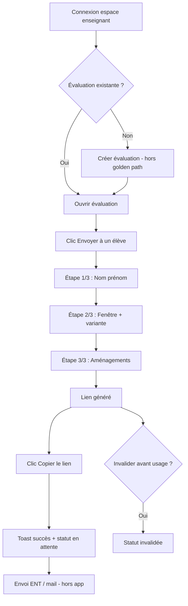
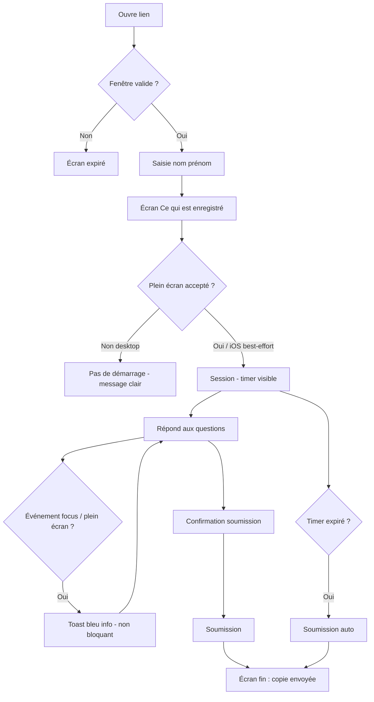
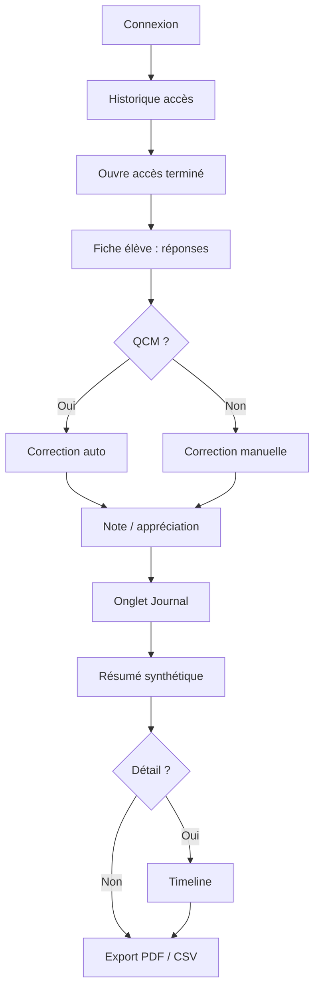

# UX Design Specification Kopie

**Author:** Gregory
**Date:** 2026-05-19

---

<!-- UX design content will be appended sequentially through collaborative workflow steps -->

## Executive Summary

### Project Vision

Kopie permet à un enseignant du secondaire français d'envoyer une **évaluation numérique à un seul élève**, de façon asynchrone, sans transformer sa pratique en surveillance de classe. L'enseignant pilote depuis un **espace de pilotage** (composition, variantes, historique) ; l'élève passe une **session minimale et rassurante** dans le navigateur, sans compte ni installation.

**Geste fondateur :** depuis une évaluation existante, publier un accès nominatif (élève, fenêtre, aménagements) et copier le lien en **moins de cinq minutes** (SM-2) — hors rédaction complète du sujet.

**Posture produit (principe UI) :** Kopie **trace et informe** ; l'enseignant interprète et décide. Aucun score anti-triche automatique, aucun vocabulaire de sanction (pas de badge « suspect », pas de copy culpabilisant côté élève).

### Target Users

| Persona | Job principal (MVP) | Notes UX |
|---------|---------------------|----------|
| **Marie** (enseignante) | Envoyer une éval async individuelle avec accommodations, récupérer réponses + journal | Non experte technique ; usage ponctuel ; besoin d'équité et de justification |
| **Lucas** (élève) | Rendre sa copie dans les règles (temps, PAP) | Sans compte ; scènes « rattrapage » vs « PAP habituel » — ton adapté ; anxiété « suis-je surveillé ? » |
| **Parent / tuteur** (facilitateur) | Aider à ouvrir le lien (souvent iOS Safari) | Prévoir copy et parcours compréhensibles pour un tiers |
| **Validateurs** (DPO, direction, référent PAP) | Audit, conformité, inclusion | Pas utilisateurs quotidiens MVP ; données et exports **audit-friendly** dès v1 |

**Non-utilisateurs MVP :** surveillance classe temps réel, SSO ENT, compte élève permanent.

### Key Design Challenges

1. **Confiance perçue** — transparence sur ce qui est enregistré, par qui, combien de temps (avant mécanismes d'intégrité).
2. **Deux expériences, un produit** — pilotage enseignant vs session élève ; RGAA AA sur **les deux** surfaces.
3. **Intégrité = contexte pour décision humaine** — pas preuve juridique ni détecteur de triche.
4. **Temps asynchrone** — fenêtres, expiration, statuts, reprise après coupure ; pas de promesse « en direct » sans temps réel.
5. **Navigateurs et matériel modeste** — Safari/iOS en dégradation explicite ; perf mode élève ; sync et file d'attente honnêtes.
6. **RGPD et cycle de vie des données** — minimisation mineurs, rétention, export ; conflits archive pédagogique / effacement à cadrer en UX.
7. **Charge de revue** — journal lisible et priorisé, pas dump technique qui surcharge Marie.

### Design Opportunities

1. **Trust copywriting** — écran d'accueil élève, bandeau « ce qui est enregistré », messages post-soumission.
2. **Publier un accès en 3 étapes** — golden path depuis évaluation existante ; action imposée : copier / partager le lien.
3. **Journal comme récit pédagogique** — timeline, résumé synthétique, exports PDF/CSV pour dossier.
4. **PAP natif** — variantes, presets réutilisables, prévisualisation élève avant envoi.
5. **Statuts d'accès explicites** — en attente, en cours, terminée, expirée, invalidée (lexique stable).
6. **Première utilisation** — empty states qui enseignent « un élève, un lien ».
7. **Hors MVP explicite** — notifications, tableau de bord classe, gamification, indicateurs de « risque ».

## Core User Experience

### Defining Experience

L'expérience cœur de Kopie est une **boucle asynchrone à trois acteurs** :

1. **Marie** publie un accès individuel (élève, fenêtre, variante/aménagements) et partage le lien.
2. **Lucas** passe la session (identification légère → consignes → plein écran → réponses → confirmation → soumission).
3. **Marie** consulte réponses, journal et attribue note/appréciation.

**Action définissante du produit :** *« Publier un accès et obtenir un lien partageable en moins de cinq minutes »* (SM-2), depuis une évaluation déjà prête.

**Action définissante côté élève :** *« Rendre ma copie sans friction technique ni anxiété inutile »* — pas « prouver que je ne triche pas ».

Le produit n'est pas un LMS ni une salle d'examen surveillée : c'est un **pont ponctuel** entre un enseignant et un élève.

### Platform Strategy

| Dimension | Décision MVP |
|-----------|--------------|
| **Plateforme** | Web responsive uniquement (pas d'app native) |
| **Surfaces** | Espace enseignant (desktop/tablette, souris/clavier) ; session élève (mobile-first, touch + clavier) |
| **Navigateurs** | Chrome/Firefox desktop : support complet ; Safari/iOS : best-effort avec **dégradation explicite** dans l'UI |
| **APIs élève** | Fullscreen API, Page Visibility uniquement — pas d'extension, pas de webcam |
| **Temps réel** | Non (MVP async) — pas de libellé « en direct » ; statuts et sync différés |
| **Offline** | Pas d'offline-first ; **honnêteté réseau** : retry, file d'attente visible, brouillon local pour réponses longues |
| **Hébergement** | Cloud officielle + self-host Docker — même expérience fonctionnelle |

### Effortless Interactions

| Zone | Comportement attendu |
|------|---------------------|
| **Publication d'accès** | 3 étapes max depuis éval existante ; valeurs par défaut (fenêtre, durée) ; presets PAP réutilisables |
| **Après création du lien** | Action imposée : **copier le lien** (ou partager) ; option prévisualisation élève |
| **Côté élève — entrée** | Nom/prénom uniquement ; pas de compte, pas d'onboarding long |
| **Côté élève — session** | Timer visible avec aménagements appliqués ; avertissements non bloquants ; confirmation avant soumission |
| **Côté enseignant — suivi** | Statuts d'accès lisibles sans ouvrir chaque session (en attente, en cours, terminée, expirée, invalidée) |
| **Journal** | Résumé synthétique en premier (événements, durées) ; détail sur demande — pas de dump brut par défaut |
| **Échecs** | Messages clairs : fenêtre expirée, plein écran refusé, session déjà soumise, navigateur limité |

**Éliminer vs concurrents :** pas de configuration proctoring, pas de score anti-triche, pas de vue « classe entière » au MVP.

### Critical Success Moments

| Moment | Acteur | Succès | Échec (ruine l'expérience) |
|--------|--------|--------|----------------------------|
| **Lien copié en < 5 min** | Marie | « C'est parti pour Lucas » | Abandon du wizard, trop d'étapes |
| **Première ouverture du lien** | Lucas / parent | Comprend les règles, entre en session | Page anxiogène ou technique |
| **Démarrage session** | Lucas | Plein écran OK (ou dégradation comprise sur iOS) | Blocage sans explication |
| **Soumission** | Lucas | Confirmation claire, message de fin rassurant | Perte de réponses (sync/réseau) |
| **Lendemain — consultation** | Marie | Réponses + journal exploitables pour noter | Journal illisible ou score « triche » implicite |
| **Première utilisation globale** | Marie | Empty state « un élève, un lien » | Impression d'un LMS vide à configurer |

**Moment « aha » produit :** Marie envoie le lien le soir ; le lendemain elle ouvre résultats + journal et peut trancher en confiance.

### Experience Principles

1. **Un élève, un lien, une décision humaine** — toute interface sert ce triptyque, pas la surveillance de masse.
2. **Confiance avant contrôle** — transparence et copy rassurants avant mécanismes d'intégrité visibles.
3. **Promettre seulement ce que la technique tient** — états nommés (sync, expiration, reprise), pas de faux « verrouillage total ».
4. **Vitesse sur le golden path** — composition riche possible, mais l'envoi express depuis une éval existante est le chemin roi.
5. **Deux tons, un produit** — pilotage professionnel côté enseignant ; session sobre et bienveillante côté élève.
6. **Le journal raconte, il ne juge pas** — narration pédagogique, vocabulaire neutre, pas de sanction automatique.

## Desired Emotional Response

### Primary Emotional Goals

**Marie (enseignante)**
- **Équitable** — elle traite l'absent ou l'élève aménagé avec les mêmes exigences, adaptées.
- **En contrôle** — elle décide, interprète le journal, attribue la note ; l'outil ne la remplace pas.
- **Sereine** — moins d'angoisse du « qu'a-t-il fait derrière son écran ? » sans devenir surveillante.
- **Légitime** — capable de justifier sa décision (note, report, oral) avec des éléments factuels.

**Lucas (élève)**
- **Encadré, pas surveillé** — règles claires, session professionnelle, pas ambiance « flic ».
- **En confiance** — sait ce qui est enregistré et pourquoi ; pas de score caché ni de piège.
- **Capable** — aménagements visibles (temps, police) ; le dispositif l'aide, ne le stigmatise pas.

**Différenciation vs concurrents :** les outils « examen sécurisé » cultivent la **méfiance** (alertes, scores). Kopie cultive la **transparence** et la **responsabilité humaine**.

### Emotional Journey Mapping

| Étape | Marie | Lucas |
|-------|-------|-------|
| **Découverte / 1ère connexion** | Curiosité prudente — « est-ce conforme, simple ? » | N/A (pas de compte) |
| **Création / envoi du lien** | Efficacité, légèreté — « c'est rapide » | — |
| **Réception du lien** | — | Neutralité → légère vigilance ; le copy doit **rassurer** |
| **Pendant la session** | — | Focus, un peu de tension normale d'examen ; **pas** de panique à chaque alerte |
| **Événement suspect (focus, plein écran)** | — | Information calme : « enregistré », pas « vous trichez » |
| **Après soumission** | — | Soulagement, clarté — « c'est fini, c'est envoyé » |
| **Consultation résultats + journal** | Accomplissement + clarté — « je peux trancher » | N/A |
| **Retour d'usage (M+1)** | Familiarité — « je sais comment faire pour le prochain absent » | — |
| **Quand ça échoue** (expiré, réseau, plein écran refusé) | Frustration **contenue** si message actionnable | Pas de culpabilité — explication + issue claire |

### Micro-Emotions

| Paire | Cible Kopie | Priorité |
|-------|-------------|----------|
| Confiance vs. scepticisme | **Confiance** (outil, données, institution) | Critique |
| Accomplissement vs. frustration | **Accomplissement** sur golden path | Critique |
| Calme vs. anxiété | **Calme** côté élève lors des alertes | Critique |
| Contrôle vs. confusion | **Contrôle** côté enseignant (statuts, journal) | Haute |
| Satisfaction vs. delight | **Satisfaction** suffit — pas de gamification | Moyenne |
| Appartenance vs. isolement | **Isolement assumé** (un élève) sans sentiment de punition | Haute pour Lucas en rattrapage |

### Design Implications

| Émotion visée | Choix UX |
|---------------|----------|
| **Équité (Marie)** | Variantes PAP natives, presets, prévisualisation élève |
| **Sérénité décisionnelle** | Journal en résumé d'abord ; vocabulaire neutre (« événements », pas « infractions ») |
| **Contrôle** | Statuts d'accès explicites ; invalidation ; note/appréciation manuelle |
| **Confiance (Lucas)** | Bandeau « ce qui est enregistré » avant session ; pas de rouge « alerte » |
| **Calme pendant alertes** | Toasts non bloquants, ton informatif |
| **Accomplissement (Marie)** | Confirmation « lien copié » ; empty state guidant la 1ère utilisation |
| **Soulagement (Lucas)** | Écran de fin clair ; pas d'accès à la note au MVP |
| **Légitimité** | Export PDF/CSV soigné pour dossier / direction |

**Émotions à éviter → anti-patterns :**
- Anxiété → scores, badges rouges, copy culpabilisant
- Trahison → promesse de détection totale, « mode examen inviolable »
- Infantilisation → ton trop ludique pour un lycéen
- Surcharge → journal brut par défaut, wizard interminable

### Emotional Design Principles

1. **Informer, ne pas accuser** — chaque signal d'intégrité est un fait, pas un verdict.
2. **L'enseignant est le héros de la décision** — l'outil documente, Marie tranche.
3. **L'élève est en situation d'examen, pas d'interrogatoire** — cadre professionnel, bienveillance sobre.
4. **La fin de session doit apaiser** — message de clôture explicite des deux côtés.
5. **La répétition rassure** — 2e utilisation = même simplicité, pas de réapprentissage.
6. **Pas de surprise punitive** — rien de bloquant ou de nouveau sans avoir été annoncé avant la session.

## UX Pattern Analysis & Inspiration

### Inspiring Products Analysis

#### Google Forms / Microsoft Forms
- **Problème résolu :** créer et partager un questionnaire en minutes, sans formation.
- **Onboarding :** quasi nul — création immédiate.
- **Navigation :** liste d'évaluations → édition → partage.
- **Interactions fortes :** bouton « copier le lien », prévisualisation, une action principale par écran.
- **Limites pour Kopie :** pas de journal d'intégrité, pas de PAP, pas de posture « examen encadré ».

#### Typeform
- **Problème résolu :** répondre sans surcharge cognitive.
- **Pattern :** une question à la fois, barre de progression, confirmation finale.
- **Pertinence Kopie :** session élève — réduire l'anxiété, focus sur la tâche courante (FR-23 navigation entre questions).

#### Outils « lien unique » (Calendly, Doodle simplifié)
- **Problème résolu :** partager un accès nominatif avec créneau.
- **Pattern :** génération de lien → copie en un clic → statut de l'invitation.
- **Pertinence Kopie :** golden path Marie (SM-2), action imposée après création d'accès.

#### Interfaces pro calmes (Linear, Notion — niveau patterns)
- **Problème résolu :** piloter beaucoup d'items sans bruit visuel.
- **Pattern :** statuts en badge, filtres, tableaux denses mais lisibles, hiérarchie typographique forte.
- **Pertinence Kopie :** historique des accès (FR-33), espace enseignant.

#### Concurrence examen (Evalbox, Quilgo, Nexam, Exam.net) — anti-inspiration
- **Ce qu'ils font :** vue classe, alertes rouges, webcam, scores de risque.
- **Leçon :** Kopie ne copie pas leur dashboard ; il reprend seulement la **clarté des statuts de session** sans vocabulaire de sanction.

### Transferable UX Patterns

**Navigation**
- **Liste → détail → action** — historique des accès → fiche élève → journal / correction (espace enseignant).
- **Wizard linéaire court** — publier un accès en 3 étapes (Typeform / Calendly).
- **Session plein écran dédiée** — chrome minimal côté élève (inspiration apps focus / mode lecture).

**Interaction**
- **Copier le lien en CTA primaire** — post-création d'accès (Forms, Calendly).
- **Une question à la fois** (optionnel selon type d'éval) — session élève moins anxiogène.
- **Toasts informatifs non bloquants** — événements journalisés (inspiration apps pro, pas alertes système).
- **Confirmation explicite avant soumission** — pattern e-commerce / formulaires longs (FR-24).
- **Résumé avant détail** — journal : synthèse puis timeline (inspiration analytics lisibles).

**Visuel**
- **Palette sobre, peu de rouge** — confiance et calme (inverse des dashboards proctoring).
- **Typographie accessible** — OpenDyslexic en aménagement ; hiérarchie claire RGAA AA.
- **Badges de statut sémantiques** — couleurs neutres (gris/bleu/vert), pas rouge = « triche ».

### Anti-Patterns to Avoid

| Anti-pattern | Source typique | Pourquoi éviter pour Kopie |
|--------------|----------------|----------------------------|
| Dashboard « risque triche » | Evalbox, Quilgo | Contredit posture trace-sans-sanction |
| Onboarding LMS long | ENT, Moodle | Marie n'a pas le temps ; usage ponctuel |
| Configuration proctoring en 10 étapes | Suites examen | Tue SM-2 (< 5 min) |
| Alertes rouges plein écran | Proctoring | Anxiété élève, copy accusateur |
| Vue « classe entière » par défaut | Exam.net | Hors périmètre MVP, brouille le message |
| Gamification (points, streaks) | Apps grand public | Inadapté au contexte évaluation lycée |
| Promesse « examen 100 % sécurisé » | Marketing concurrent | Trahison de confiance |
| Logs techniques bruts par défaut | Outils dev/admin | Surcharge Marie, nuit au journal pédagogique |

### Design Inspiration Strategy

**À adopter tel quel**
- Lien copiable en CTA principal après création d'accès.
- Wizard court à étapes numérotées pour « publier un accès ».
- Liste d'items avec statuts visuels (historique des accès).
- Confirmation avant action irréversible (soumission).

**À adapter**
- **Typeform « une question à la fois »** — selon paramètre d'évaluation ; garder navigation si l'enseignant le désactive.
- **Patterns analytics** — résumé + drill-down pour le journal, pas pour un tableau de bord classe.
- **Forms** — richesse de composition côté enseignant, sans la lourdeur d'un LMS.

**À éviter**
- Tout héritage visuel ou lexical du proctoring (rouge alerte, « fraude », « suspicion »).
- Multiplication des écrans avant le premier lien envoyé.
- Mode « surveillance live » même en option.

**Positionnement design :** Kopie doit se sentir comme **« un Forms bien pensé pour un élève, avec un carnet de bord pour le prof »** — pas comme une salle d'examen virtuelle.

## Design System Foundation

### 1.1 Design System Choice

**Approche retenue : Tailwind CSS + bibliothèque de composants headless (recommandation : shadcn/ui sur Radix UI)**

- **Tailwind CSS** — utilitaires, design tokens (couleurs, espacements, typo), deux thèmes possibles (enseignant / élève).
- **shadcn/ui** (ou équivalent Radix + Tailwind) — composants copiables dans le repo, accessibles (RGAA/WAI-ARIA), personnalisables, pas de dépendance npm opaque lourde.
- **Radix UI** (via shadcn) — primitives accessibles : Dialog, Toast, Select, Tabs — adaptées wizard, alertes non bloquantes, session élève.

**Non retenu pour le MVP :**
- Design system 100 % custom — coût initial trop élevé pour OSS MVP.
- Material Design / Ant Design « out of the box » — look générique, surcharge visuelle, moins aligné posture sobre Kopie.

### Rationale for Selection

1. **Alignement stack** — cohérent avec React/Vite/Tailwind déjà indicatif dans le PRD/addendum.
2. **Vitesse OSS** — composants éprouvés, documentation communautaire, contributions facilitées.
3. **Accessibilité** — Radix + tests RGAA AA sur parcours élève ; OpenDyslexic en couche aménagement (font-family token).
4. **Dualité enseignant / élève** — thèmes CSS variables : `theme-teacher` (dense, pro) vs `theme-student` (minimal, apaisant).
5. **Pas de rouge « alerte triche »** — tokens sémantiques (`--status-pending`, `--status-complete`, `--event-logged`) plutôt que palette Material par défaut.
6. **Maintenance long terme** — shadcn = code dans le repo AGPL, pas vendor lock-in UI.

### Implementation Approach

**Phase 1 — Fondations (sprint design system)**
- Définir `tailwind.config` + CSS variables (couleurs, typo, rayons, ombres).
- Installer shadcn/ui (Button, Input, Label, Dialog, Toast, Badge, Card, Table, Tabs, Progress).
- Documenter tokens dans Storybook ou page `/design-system` interne (optionnel MVP).

**Phase 2 — Composants métier**
- `AccessStatusBadge` — statuts accès (en attente, en cours, terminée, expirée, invalidée).
- `SessionProgress` — barre progression session élève.
- `IntegrityToast` — toast non bloquant événement journalisé.
- `CopyLinkButton` — CTA primaire post-création accès.
- `JournalSummary` + `JournalTimeline` — résumé puis détail.

**Phase 3 — Thèmes**
- Layout enseignant : sidebar + contenu (pattern Linear/Notion).
- Layout élève : plein écran, chrome réduit, focus typographique.

**Contraintes techniques**
- Purge Tailwind en production (perf matériel modeste).
- Contraste RGAA AA vérifié sur paires texte/fond des deux thèmes.
- Polices : stack système + `@font-face` OpenDyslexic chargée uniquement si aménagement actif.

### Customization Strategy

| Élément | Stratégie |
|---------|-----------|
| **Couleurs** | Palette sobre (bleu/gris/neutre) ; vert = succès/soumis ; orange = attention (expiration) ; **pas de rouge sémantique « danger/triche »** pour événements journalisés |
| **Typographie** | Enseignant : Inter ou système ; Élève : même base + OpenDyslexic option |
| **Espacement** | Élève : plus d'air, boutons touch-friendly (44px min) |
| **Composants shadcn** | Override via `className` Tailwind + variants CVA ; pas de fork sauf session élève |
| **Iconographie** | Lucide React — cohérent, léger |
| **Dark mode** | Hors MVP (option v2) — priorité contraste clair RGAA |
| **i18n** | Classes Tailwind indépendantes de la langue ; longueurs FR anticipées dans layouts flex |

**Gouvernance :** toute nouvelle UI passe par composants du design system ; exceptions documentées (ex. mode plein écran session).

## 2. Core User Experience (Defining Interaction)

### 2.1 Defining Experience

**L'expérience signature de Kopie :** *« Publier un accès individuel et copier le lien »* — en moins de cinq minutes depuis une évaluation existante.

C'est ce que Marie racontera à une collègue : pas « j'ai configuré un LMS », mais **« j'ai envoyé le contrôle à l'absent avec le lien, comme un Forms, mais cadré »**.

Interactions secondaires critiques (si la signature réussit) :
- Lucas **soumet** sa session sans perdre ses réponses.
- Marie **lit le journal** et tranche le lendemain.

Si l'envoi du lien échoue (trop long, trop complexe), le produit n'existe pas pour elle — peu importe la richesse du journal.

### 2.2 User Mental Model

**Modèle mental actuel de Marie**
- « Je dois faire passer le contrôle à l'absent » → solutions improvisées : PDF par mail, visio, Google Forms sans cadre.
- Attente : **comme un lien à partager** (Forms, ENT) + **preuves si besoin** (pas un outil de police).

**Modèle mental de Lucas**
- « Je dois rendre mon devoir dans les règles » — pas « je dois battre un anti-triche ».
- Attente : consignes claires, temps visible, pas de piège.

**Où la confusion menace**
- Croire que Kopie = surveiller une classe (Evalbox).
- Croire que les alertes = note de triche automatique.
- Croire que le plein écran = garantie absolue (déception iOS).

**Ce qu'ils aiment / détestent ailleurs**
- ✅ Forms : rapidité, lien, simplicité.
- ❌ Proctoring : webcam, stress, score opaque.
- ❌ LMS : lourdeur pour un cas ponctuel.

### 2.3 Success Criteria

| Critère | Cible | Mesure |
|---------|-------|--------|
| **Time-to-link** | < 5 min depuis éval existante | SM-2 |
| **Compréhension immédiate** | Marie sait quoi faire après 1er empty state | Test utilisateur quali |
| **Lien copié** | CTA « Copier le lien » utilisé à > 80 % des créations | Analytics |
| **Session complétée** | Lucas soumet sans erreur réseau bloquante | SM-3 |
| **Décision lendemain** | Marie ouvre journal + réponses en < 3 min | Test tâche |
| **Vocabulaire** | Zéro libellé « triche / fraude / suspect » côté élève | Revue copy |

**« Ça marche » pour Marie :** bandeau vert « Lien copié », statut « en attente » visible dans l'historique.

**« Ça marche » pour Lucas :** écran de fin « Votre copie a bien été envoyée ».

### 2.4 Novel UX Patterns

**Combinaison de patterns établis + twist Kopie**

| Pattern | Statut | Twist Kopie |
|---------|--------|-------------|
| Wizard 3 étapes (Calendly) | Établi | + variante PAP + fenêtre temporelle |
| Copier le lien (Forms) | Établi | + token usage unique + invalidation |
| Une question à la fois (Typeform) | Établi | Optionnel selon éval |
| Toasts d'événement | Établi | **Informatif, non accusateur** — événement journalisé |
| Journal / timeline | Établi (analytics) | **Récit pédagogique**, pas score de risque |
| Plein écran examen | Établi | **Honnêteté iOS** + pas de blocage dur MVP |

**Élément le plus « nouveau » pour l'utilisateur :** le journal comme aide à la décision **sans** sanction automatique — éducation légère requise (copy enseignant + élève).

**Métaphore familière :** « Un devoir maison avec un carnet de bord pour le prof. »

### 2.5 Experience Mechanics

#### Interaction signature : Publier un accès et copier le lien

**1. Initiation**
- Déclencheur : Marie ouvre une **évaluation existante** (ou en crée une, hors golden path).
- Invitation : bouton primaire **« Envoyer à un élève »** / **« Créer un accès »** visible sur la fiche éval.

**2. Interaction (wizard ≤ 3 étapes)**

| Étape | Contenu | Défauts intelligents |
|-------|---------|---------------------|
| 1 | Nom, prénom élève | — |
| 2 | Fenêtre (début/fin), variante (standard / PAP) | Derniers créneaux utilisés |
| 3 | Aménagements (tiers-temps, OpenDyslexic, agrandissement) | Preset PAP si variante PAP |
| Fin | Lien généré + **bouton Copier** en focus | — |

**3. Feedback**
- Progression : « Étape 2/3 ».
- Succès : toast + encart « Lien copié dans le presse-papiers ».
- Historique : nouvelle ligne statut **« en attente »**.

**4. Completion**
- Prochaine action suggérée : « Envoyer via l'ENT ou par mail » (texte d'aide, pas intégration MVP).
- Retour liste des accès ou fiche élève.

#### Mécanique secondaire : Session élève (si signature OK)

**Initiation** — ouverture lien → identification nom/prénom → écran « Ce qui est enregistré ».

**Interaction** — plein écran → questions → toasts non bloquants sur événements.

**Feedback** — timer visible, barre progression.

**Completion** — dialogue confirmation → soumission → écran de fin apaisant.

## Visual Design Foundation

### Color System

**Direction :** palette **sobre et institutionnelle**, inspirée outils pro (Linear, Notion) — pas ambiance « salle d'examen rouge ».

**Thème enseignant (`theme-teacher`)**

| Token sémantique | Rôle | Valeur indicative (HSL) | Usage |
|------------------|------|-------------------------|--------|
| `--background` | Fond page | `210 20% 98%` | Canvas principal |
| `--foreground` | Texte | `222 47% 11%` | Corps, titres |
| `--primary` | Action principale | `221 83% 53%` | CTA « Copier le lien », boutons primaires |
| `--primary-foreground` | Texte sur primary | `0 0% 100%` | — |
| `--secondary` | Surfaces secondaires | `210 40% 96%` | Cartes, sidebar |
| `--muted` | Texte secondaire | `215 16% 47%` | Labels, métadonnées |
| `--border` | Bordures | `214 32% 91%` | Séparateurs, inputs |
| `--success` | Succès / soumis | `142 71% 45%` | Lien copié, statut terminée |
| `--warning` | Attention | `38 92% 50%` | Expiration proche, en cours |
| `--info` | Information | `199 89% 48%` | Événements journalisés, toasts |
| `--destructive` | Action destructive uniquement | `0 72% 51%` | Invalider accès — **pas** pour événements d'intégrité |

**Statuts d'accès (badges)**

| Statut | Couleur | Icône |
|--------|---------|-------|
| En attente | `muted` + bordure | Horloge |
| En cours | `warning` (doux) | Play |
| Terminée | `success` | Check |
| Expirée | `muted` barré | CalendarX |
| Invalidée | `destructive` léger | Ban |

**Thème élève (`theme-student`)**
- Fond plus clair, **moins de chrome** — quasi monochrome + accent primary discret.
- **Pas de rouge** pour événements journalisés — utiliser `--info` (bleu) pour toasts « événement enregistré ».
- Contraste texte/fond **≥ 4,5:1** (RGAA AA) sur tous les textes.

**Règle Kopie :** `--destructive` réservé aux actions irréversibles enseignant ; jamais pour signaler un comportement élève.

### Typography System

**Ton :** professionnel, moderne, lisible — proche établissement scolaire numérique, pas startup ludique.

| Niveau | Enseignant | Élève | Taille / line-height |
|--------|------------|-------|---------------------|
| **Display** | Titres page | Titre session | 1.875rem / 2.25rem — lh 1.2 |
| **H1** | Nom évaluation | Consigne principale | 1.5rem — lh 1.3 |
| **H2** | Sections | Énoncé question | 1.25rem — lh 1.4 |
| **Body** | UI, tableaux | Réponses, instructions | 1rem (16px min) — lh 1.5 |
| **Small** | Métadonnées, statuts | Aide contextuelle | 0.875rem — lh 1.4 |

**Font stacks**
- **Par défaut :** `Inter, system-ui, -apple-system, sans-serif`
- **Aménagement OpenDyslexic :** `OpenDyslexic, Inter, sans-serif` — classe `font-dyslexic` sur session élève
- **Agrandissement texte :** scale 125 % / 150 % via token `--text-scale`

### Spacing & Layout Foundation

**Unité de base :** 4px (échelle Tailwind : 4 = 16px, 6 = 24px, 8 = 32px).

| Contexte | Densité | Padding carte | Gap formulaires |
|----------|---------|---------------|-----------------|
| **Espace enseignant** | Modérée-dense | `p-4` à `p-6` | `gap-4` |
| **Session élève** | Aérée | `p-6` à `p-8` | `gap-6` |
| **Wizard accès** | Aérée | `max-w-lg` centré | `gap-6` |

**Grille** — Enseignant : sidebar `240px` + contenu `max-w-6xl` ; Élève : colonne unique `max-w-2xl` centrée.

### Accessibility Considerations

- **RGAA niveau AA** sur parcours élève (priorité).
- Cibles tactiles **44×44px** minimum session élève.
- Focus visible : ring `2px` primary.
- Statuts = icône + texte (pas couleur seule).
- `prefers-reduced-motion` respecté.
- Mode clair uniquement au MVP.

## Design Direction Decision

**Visualiseur :** `_bmad-output/planning-artifacts/ux-design-directions.html`

### Design Directions Explored

Six directions explorées (D1–D6) sur écran enseignant + session élève. Voir HTML pour comparaison interactive.

### Chosen Direction

**D2 — Calme professionnel** (validé par Gregory)

- Primary `#2563eb`, fonds slate clair, sidebar blanche.
- Badges statut : jaune doux (en attente), vert (terminée) — pas de rouge pour intégrité.
- Session élève : fond clair, carte question centrée, toast bleu informatif.

### Design Rationale

- Aligné objectifs émotionnels (confiance, calme, professionnalisme).
- Distinct des dashboards proctoring.
- Compatible Tailwind + shadcn/ui et tokens HSL définis en § Visual Design Foundation.

### Implementation Approach

- Thèmes `theme-teacher` et `theme-student` basés sur D2.
- Composants shadcn default + overrides `globals.css`.
- Wireframes détaillés UJ-1 à UJ-3 alignés sur D2.

## User Journey Flows

### UJ-1 — Marie envoie un rattrapage à un absent

**Contexte :** lendemain du contrôle, évaluation déjà créée, élève absent justifié.

**Objectif :** lien généré et copié en < 5 min ; accès « en attente » dans l'historique.

**Points d'attention :** CTA copier en focus ; défauts fenêtre mémorisés ; retour historique accès.

**Erreurs :** fenêtre expirée avant démarrage → statut expirée, pas de session partielle exposée.

### UJ-2 — Lucas passe l'évaluation avec aménagements PAP

**Contexte :** lien reçu, tiers-temps +50 %, OpenDyslexic, pas de compte.

**Points d'attention :** pas de rouge sur toasts ; police dyslexie ; timer avec coefficient PAP ; pas de note affichée au MVP.

**Cas limite iOS :** sortie plein écran → journalisé + avertissement, passage possible si retour.

### UJ-3 — Marie analyse résultats et journal

**Contexte :** lendemain matin, accès « terminée ».

**Points d'attention :** résumé journal avant timeline ; vocabulaire neutre ; export pour dossier.

### Journey Patterns

| Pattern | Usage |
|---------|--------|
| Liste → fiche → action | Accès, évaluations, journal |
| Wizard 3 étapes + CTA final | Création accès (UJ-1) |
| Gate temporel | Fenêtre accès (UJ-2) |
| Résumé → détail | Journal (UJ-3) |
| Toast informatif non bloquant | Événements session (UJ-2) |
| Confirmation irréversible | Soumission élève (UJ-2) |
| Badges statut D2 | Historique accès |

### Flow Optimization Principles

1. **Minimum de clics vers le lien** — UJ-1 : 3 étapes + copier.
2. **Annoncer avant d'enregistrer** — transparence avant session élève.
3. **Jamais bloquer sur événement intégrité** au MVP — tracer, continuer.
4. **Décision enseignant en 2 panneaux** — réponses puis journal, même fiche.
5. **Messages d'échec actionnables** — expiré, plein écran refusé, réseau (retry).

## Component Strategy

### Design System Components

**Fournis par shadcn/ui (Radix + Tailwind, thème D2) :**

| Composant | Usage Kopie |
|-----------|-------------|
| `Button` | CTA primaires, copier lien, soumission |
| `Input` / `Label` | Wizard accès, identification élève |
| `Dialog` | Confirmation soumission, invalider accès |
| `Toast` | Lien copié, événements journalisés |
| `Badge` | Statuts accès |
| `Card` | Fiches éval, session élève |
| `Table` | Historique accès |
| `Tabs` | Réponses / Journal (UJ-3) |
| `Progress` | Barre progression session |
| `Select` / `Checkbox` | Aménagements, variantes |
| `Separator` | Layout enseignant |

### Custom Components

#### AccessStatusBadge

- **Purpose :** Statut d'un accès individuel (FR-33).
- **States :** en attente, en cours, terminée, expirée, invalidée.
- **Variants :** couleurs D2 — jamais rouge « triche ».
- **Accessibility :** `role="status"`, texte + icône.

#### CopyLinkButton

- **Purpose :** CTA post-création accès.
- **States :** default, copied (2s), error presse-papiers.
- **Accessibility :** annonce « Lien copié ».

#### AccessWizard

- **Purpose :** 3 étapes — élève, fenêtre/variante, aménagements.
- **States :** step active, validation inline.

#### StudentSessionShell

- **Purpose :** Layout plein écran session élève.
- **Variants :** `font-dyslexic`, `--text-scale` 125/150 %.

#### IntegrityToast

- **Purpose :** Événement journalisé sans bloquer (FR-22).
- **States :** info bleu D2 uniquement.

#### JournalSummary / JournalTimeline

- **Purpose :** Résumé puis chronologie (FR-28, FR-25–26).

#### QuestionRenderer

- **Purpose :** Types MVP : choix, courte, texte libre (FR-5).

#### TransparencyBanner

- **Purpose :** « Ce qui est enregistré » avant session.

### Component Implementation Strategy

- Custom components dans `components/kopie/` ; shadcn dans `components/ui/`.
- Tokens D2 uniquement ; tests a11y (jest-axe) sur parcours élève.

### Implementation Roadmap

**Phase 1 — Golden path :** AccessWizard, CopyLinkButton, AccessStatusBadge, StudentSessionShell, TransparencyBanner, IntegrityToast, QuestionRenderer.

**Phase 2 — UJ-3 :** JournalSummary, JournalTimeline, Tabs, export.

**Phase 3 — Enrichissement :** éditeur éval, banque, import CSV, prévisualisation élève.

## UX Consistency Patterns

### Button Hierarchy

| Niveau | Usage | Style D2 |
|--------|-------|----------|
| **Primaire** | Une action principale par écran : Copier le lien, Envoyer à un élève, Soumettre | Bleu `#2563eb` |
| **Secondaire** | Annuler, Précédent (wizard) | Outline |
| **Tertiaire / ghost** | Voir journal, prévisualiser | Texte ou ghost |
| **Destructif** | Invalider accès uniquement | Rouge — jamais pour comportement élève |

**Règle :** max 1 primaire visible ; secondaires à gauche du primaire (desktop) ou empilés (mobile).

### Feedback Patterns

| Type | Quand | Visuel |
|------|-------|--------|
| **Succès** | Action complétée | Vert + toast |
| **Info** | Événement journalisé | Bleu — IntegrityToast |
| **Attention** | Expiration proche | Orange doux |
| **Erreur** | Blocage réel | Message + action |
| **Interdit MVP** | Score triche, alerte rouge | Non utilisé |

**Durée toasts :** 4–6 s, dismissible.

### Form Patterns

- Labels au-dessus ; validation inline ; erreurs actionnables.
- Groupement : identité | fenêtre | aménagements.
- Défauts intelligents (dernière fenêtre, preset PAP).

### Navigation Patterns

**Enseignant :** sidebar fixe (Évaluations · Accès · Banque · Profil) ; fil d'Ariane sur fiches profondes.

**Élève :** parcours linéaire sans menu global ; pas de hamburger.

### Additional Patterns

- **Modales :** soumission (irréversible), invalider accès (destructif) ; focus trap.
- **Empty states :** 1ère utilisation et historique vide avec CTA guidé.
- **Chargement :** skeleton listes ; spinner sur bouton ; saisie non bloquée en session.
- **Badges :** icône + libellé ; couleurs D2.
- **Copy :** vouvoiement ; « enregistré », « événement » — pas « triche » / « fraude ».

## Responsive Design & Accessibility

### Responsive Strategy

| Surface | Priorité | Stratégie |
|---------|----------|-----------|
| **Session élève** | Mobile-first | Colonne unique, touch 44px, timer visible, plein écran |
| **Espace enseignant** | Desktop-first | Sidebar + contenu ; tablette = sidebar rétractée |
| **Wizard accès** | Mobile OK | `max-w-lg` centré ; boutons pleine largeur < 768px |

**Desktop (≥ 1024px) :** sidebar 240px, tableaux historique accès.

**Tablette (768–1023px) :** sidebar icônes ou drawer.

**Mobile (< 768px) :** drawer enseignant ; session élève plein écran.

### Breakpoint Strategy

Breakpoints Tailwind : `sm` 640px · `md` 768px · `lg` 1024px · `xl` 1280px.

**Approche :** mobile-first ; tests iPhone Safari (élève) + Chrome desktop (enseignant).

### Accessibility Strategy

**Cible : RGAA niveau AA** (parcours élève prioritaire).

| Exigence | Implémentation |
|----------|----------------|
| Contraste | ≥ 4,5:1 |
| Texte | 16px min ; scale 125/150 % |
| Touch | 44×44px min |
| Clavier | Focus ring ; ordre tab logique |
| Screen readers | Labels, `role="status"`, live regions toasts |
| Couleur | Statuts = icône + texte |
| Mouvement | `prefers-reduced-motion` |
| OpenDyslexic | Chargement conditionnel FR-12 |

**Safari/iOS :** limites plein écran documentées ; pas de promesse verrouillage total.

### Testing Strategy

**Responsive :** Chrome/Firefox desktop ; Safari macOS + iOS ; 320px–1920px.

**Accessibilité :** axe-core / jest-axe ; clavier UJ-1–3 ; VoiceOver + NVDA ; test daltonisme badges.

**Bêta :** au moins 1 prof + 1 élève PAP.

### Implementation Guidelines

**Responsive :** `rem` / `%` ; images responsives ; pas de hover-only sur touch.

**Accessibilité :** HTML sémantique ; ARIA minimal ; skip link enseignant ; focus modales ; live regions toasts.

**Performance :** FCP élève < 3s ; file d'attente sync visible.
